# AI开发游戏保姆级教程

## 提示词：

> 我是一名完全零基础的编程小白，想要基于 Phaser.js 开发一款中大型 HTML5 网页游戏，需要你全程协助我从零完成开发。请严格按照以下要求开展协作：
>
> 1. 【核心基础规则】
>
> - 技术栈固定为 HTML + JavaScript + Phaser.js，最终产物可直接在浏览器运行
>
> - 项目定位为中大型游戏，架构设计必须满足三大核心要求：运行高性能、功能高扩展性、代码高可维护性
>
> - 所有代码必须附带详细的中文注释，每阶段输出都要有通俗易懂的功能说明，完全适配零基础的理解能力
>
> 2. 【第一步：输出标准化项目架构】
>
> 请先为我设计并输出一套工程化的完整项目目录结构，专门适配中大型游戏迭代开发，至少包含：
>
> - 场景分层管理（启动页、资源加载页、主菜单、游戏主场景、暂停/结算弹窗等）
>
> - 模块化组件设计（玩家、敌人、UI、道具、特效、数值系统等独立模块）
>
> - 资源分类管理（图片、音频、配置表、关卡数据等分目录存放）
>
> - 全局状态管理、事件总线、常量配置、工具函数、公共基类抽离 输出结构时必须附带每个目录/核心文件的作用说明，方便我理解整体框架。
>
> 3. 【第二步：问答式需求调研与开发】
>
> 项目结构经我确认后，请采用「你问我答」的形式，逐步调研游戏的完整需求。 请分模块、分优先级提问，**每轮只聚焦1-2个核心方向**，不要一次性抛出大量问题；待我明确答复后，再推进下一个环节，最终将需求落地为可运行的完整代码。
>
> 4. 【长期开发规范】 后续所有功能开发，都遵循「先讲模块设计思路→再输出带注释代码→最后讲解调用/修改方式」的流程，在保障代码质量的同时，让我能看懂、能自主调整基础内容。

## 推荐AI绘图平台：

XMAI：[XMAI - 设计创作全能AI助手](https://xmai.net/?ref=RPCPGXUB)

## 自定义编辑器的提示词

很多人咨询自定义编辑器是如何做到，这里给大家提供一个提示词，大家可以参考下，很简单的。你把自己想象成老板，把AI想象成是你的员工就行了。

**我以这个地图编辑器为例：**

> 目前的大地图呢是写死的，我如果后期想新增地图，不同区域的地图，不是很方便，我希望能够自己添加各种不同的大地图，所以希望你能帮我开发个自定义地图编辑器，让管理员可以自行上传地图。新增地图可以无限拼接原来的地图。形成一个无缝的无限大地图。可以设置添加在初始地图的上、下、左、右位置。可以设置地图的名字。我做的地图素材是5*5的，就是5行5列，共25张图拼接成的完整地图。请你根据我这个想法，帮我出一个方案，一定要方便管理、方便维护。只出方案。不写代码。

## 设计玩家角色

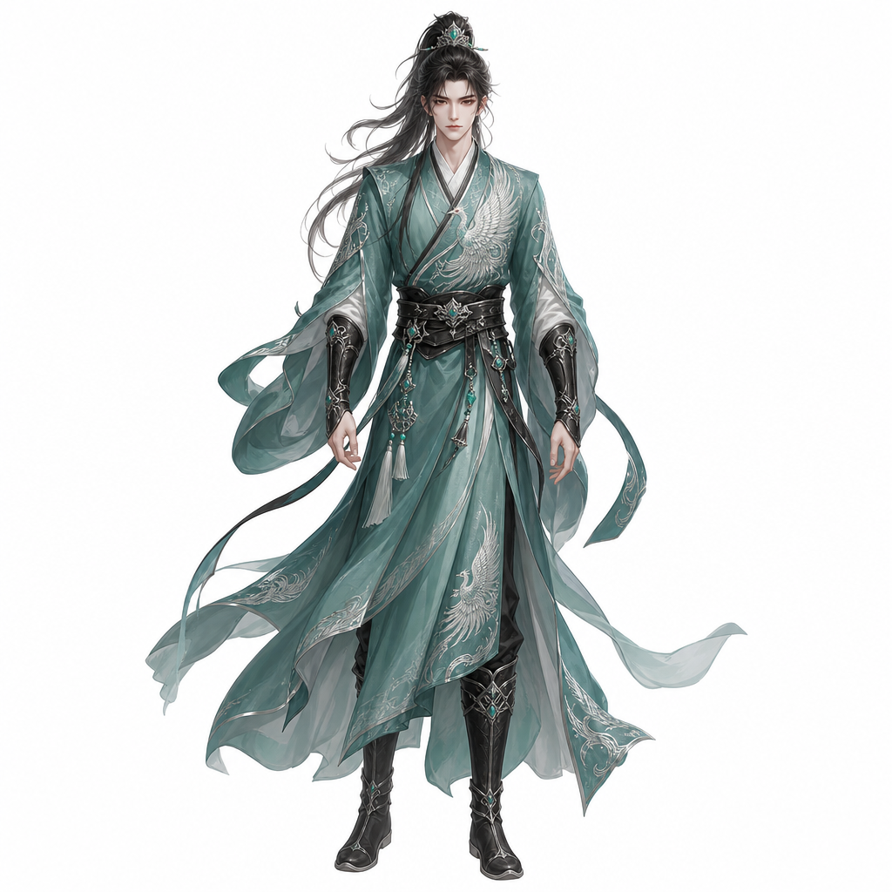

**提示词：**

> ## 主体描述
>
> 东方古风男性仙侠风格角色，梳着搭配青绿色发饰的黑色高马尾，身穿青绿色交领右衽宽袖长袍，衣饰上点缀着精致的银白色凤凰纹样，辅以黑色腰带、护腕与长靴，整体造型层次丰富且飘逸动感，完美融合了传统汉服元素与战斗实用性，展现出一种清冷、高洁而又英武潇洒的超凡气质。
>
> ## 绘画风格
>
> 中国修仙手绘风格，角色设计稿，高品质角色立绘，手绘厚涂，细腻笔触，色彩层次丰富，服饰纹理精致，材质刻画细腻，布料自然褶皱，金属高光真实，玉石温润，仙侠美术风格，国风幻想，仙气氛围。
>
> ## 构图要求
>
> 全身完整展示，角色站立，正面视角，身体比例协调，人物居中，占画面约70%～85%，四肢完整无遮挡，不裁切头部和脚部，方便后期裁切与建模参考。
>
> ## 背景要求
>
> 纯白色背景，无场景，无地面，无阴影背景，无边框，无UI，仅保留角色本体。
>
> ## 光照要求
>
> 柔和自然光，均匀受光，适度体积光，角色轮廓清晰，服装细节清晰可见，避免过曝和死黑，整体明亮。
>
> ## 画面质量
>
> 超高精度，8K，高细节，专业游戏角色设定图，高清晰度，线条干净，颜色纯净，细节丰富，可用于游戏角色设定集。

## 8方位行走图

| 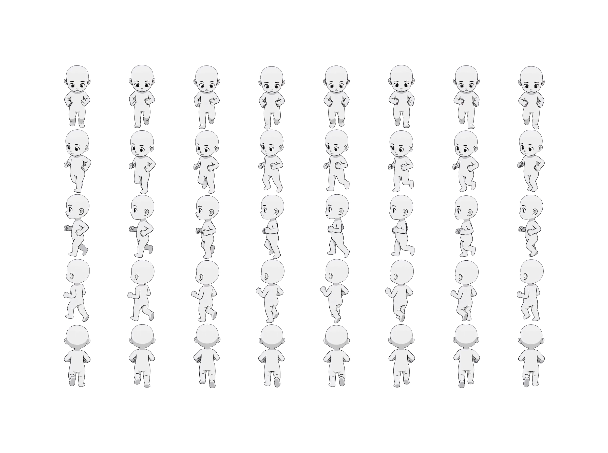 | 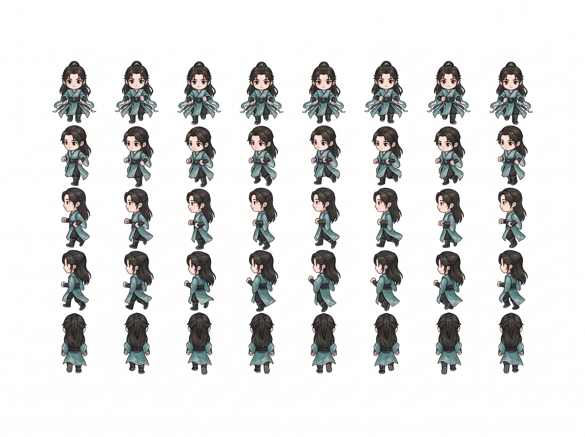 |
| --- | --- |

**提示词：**

> 将图1的角色精灵图里的人物，换成图2的人物，下面是具体要求：
>
> 角色精灵图，多帧角色动画，姿势顺序与参考图1相同，姿势高度一致，8列5行，全身像，身体比例一致，动作顺序一致，每帧间距均匀，无重叠
>
> 纯白色背景，无阴影，无环境，比例一致，风格统一，游戏素材，RPG角色精灵图，专业角色设计
>
> 使用参考图1中的精确姿势顺序，不更改姿势，不重新设计动作，仅替换角色外观
>
> 负面提示词：
> 姿势不一致，动作不同，比例变化，人物不同，多个角色合并，重叠，身体裁剪，透视错误，布局混乱，背景、阴影、模糊、低质量

## 8方位待机图

| 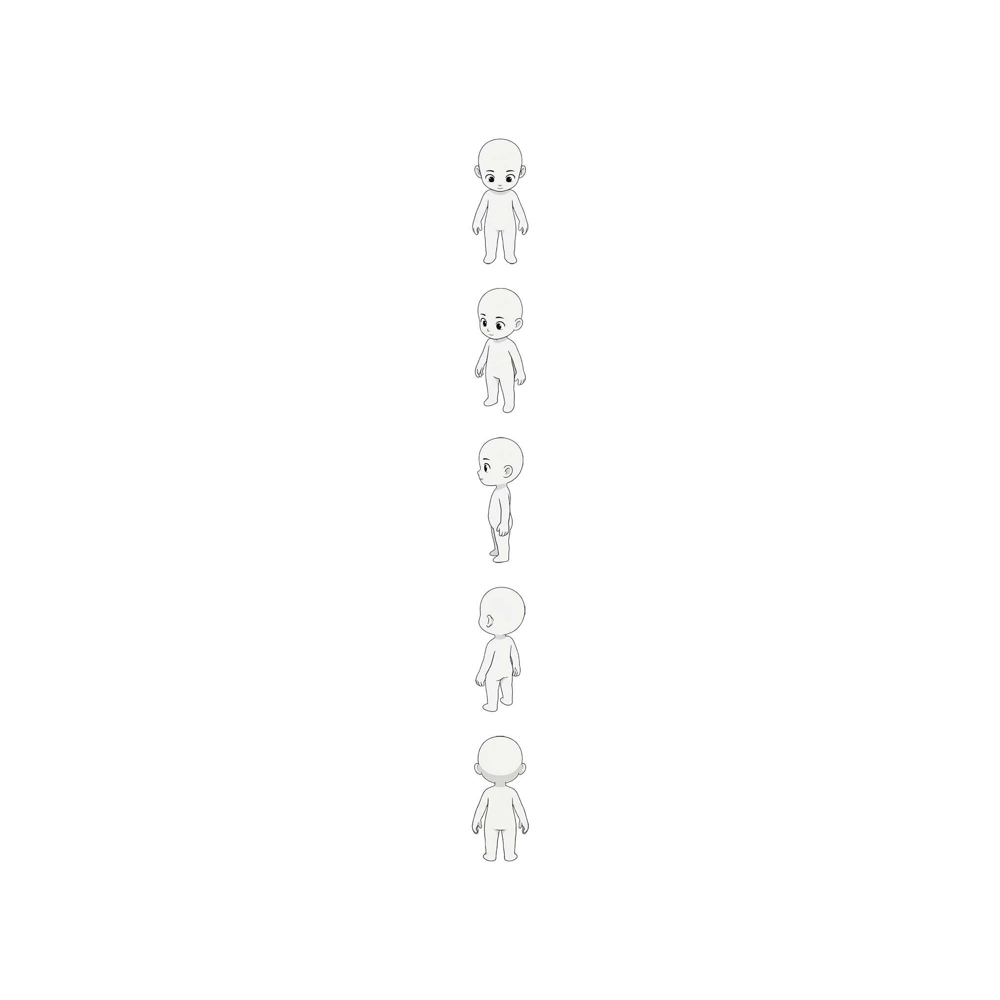 | 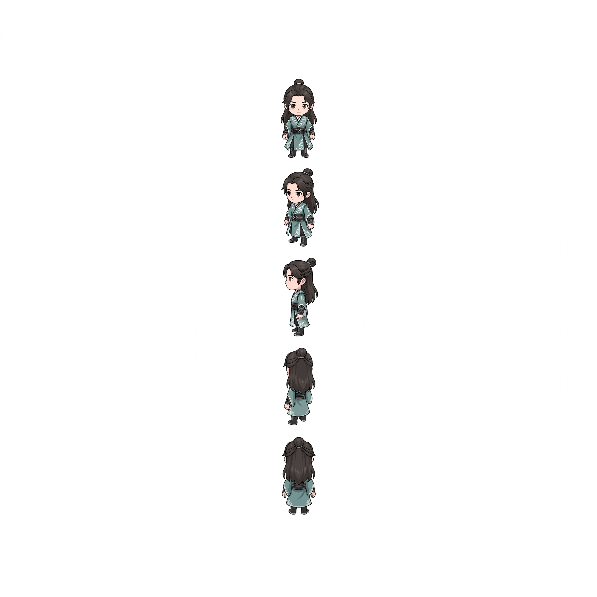 |
| --- | --- |

**提示词：**

> 将图1的角色精灵图里的人物，换成图2的人物，下面是具体要求：
>
> 角色精灵图，姿势顺序与参考图1相同，姿势高度一致，全身像，身体比例一致，无重叠
>
> 纯白色背景，无阴影，无环境，比例一致，风格统一，游戏素材，RPG角色精灵图，专业角色设计
>
> 使用参考图1中的精确姿势顺序，不更改姿势，不重新设计动作，仅替换角色外观
>
> 负面提示词：
>
> 姿势不一致，动作不同，比例变化，人物不同，多个角色合并，重叠，身体裁剪，透视错误，布局混乱，背景、阴影、模糊、低质量

在游戏里替换真实素材的提示词：

> 角色8方位待机图.png、角色8方位行走图.png 跟目录有2个角色文件，请将游戏中的行走小人，换成这个真实的素材，注意，需要先将文件重命名，然后移动到对应的位置，注意，这2个素材都是5个方向的，分别是，下、左下、左、左上、上，角色8方位待机图.png是1行1帧，角色8方位行走图.png是一行8帧

## 玩家角色战斗姿态

**转战斗姿势提示词：**

> 游戏角色，紧凑战斗姿态，小步幅站位，脚步跨度小，身体与视线均朝向画面右侧，面向右方注视敌人，整体姿势统一朝向右侧，沉稳有力的备战动作，无光效无灰尘无粒子特效，无多余环境与装饰元素，纯白背景，干净纯净的角色主体，仅调整人物姿势，无额外添加效果，适合抠图，高清细节，游戏原画质感

**将角色变动态效果提示词：**

> 中国奇幻男性修仙者，全身像，站立待机动画，回合制RPG待机姿势，呼吸动作轻柔，胸膛微微起伏，长发随风轻拂，袖子轻轻飘动，神态沉稳专注，衣摆轻微摆动，微风拂面，身体动作极少，站姿稳固，循环动画，动作流畅，细节丰富，背景干净，2D游戏角色动画，无镜头移动，无缩放，无变形，完美无缝循环，首帧与末帧一致，无行走，无攻击，无跳跃，头不要动，无旋转，无身体转动，无姿势变化

## 视频抠图工具：

链接: [https://pan.baidu.com/s/1BR-zqY_Jw1YgATtNYOr3vg](https://pan.baidu.com/s/1BR-zqY_Jw1YgATtNYOr3vg) 提取码: k3c8

使用教程：[https://www.yuque.com/zeejk/kt12r4/fuffzb1dmvtk6wd0?singleDoc#](https://www.yuque.com/zeejk/kt12r4/fuffzb1dmvtk6wd0?singleDoc#)

## 绘制妖兽

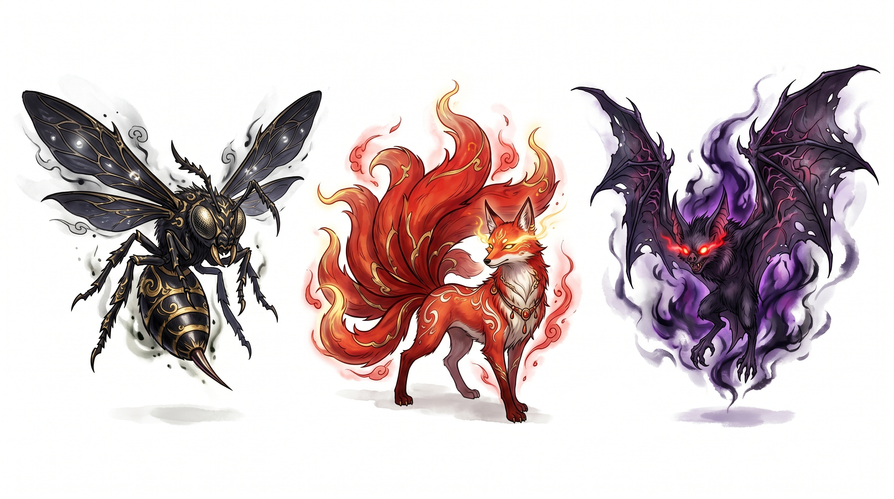

```text
一张图中包含3种不同的怪物，水平排列成一行，1x3布局，间距均匀，全身像，互不重叠，独立角色，干净的背景，游戏素材图

1) 一只翅膀漆黑、毒刺致命的毒蜂
2) 一只毛色赤红、散发神秘气息、双目闪烁的狐妖
3) 一只拥有暗影能量、双目闪烁着红光的邪恶蝙蝠

中国仙侠奇幻风格，修仙世界生物，手绘插画，线条细腻，阴影柔和，游戏卡牌风格，细节丰富，光照均匀，构图简洁
无文字，白色背景或透明背景
```

## 让妖兽/角色 动起来

将游戏角色图片和下面的提示词发给ai，可以获得一个角色动态视频的提示词

```text
【提示词修改任务】
中国奇幻男性修仙者，全身像，站立待机动画，回合制RPG待机姿势，呼吸动作轻柔，胸膛微微起伏，长发随风轻拂，袖子轻轻飘动，神态沉稳专注，衣摆轻微摆动，微风拂面，身体动作极少，站姿稳固，循环动画，动作流畅，细节丰富，背景干净，2D游戏角色动画，无镜头移动，无缩放，无变形，完美无缝循环，首帧与末帧一致，无行走，无攻击，无跳跃，头不要动，无旋转，无身体转动，无姿势变化 

上面是一段AI视频生成的提示词，但是提示词主体跟我要的不一样，我想让你帮我将这个提示词主体改成这个参考图的，换成适配这个【龙】的吧
```

## 地图制作

先准备个素材，在PS里新建个2048px * 2048px尺寸的画布，将玩家角色放在还不中心，并缩小角色，类似下面的效果

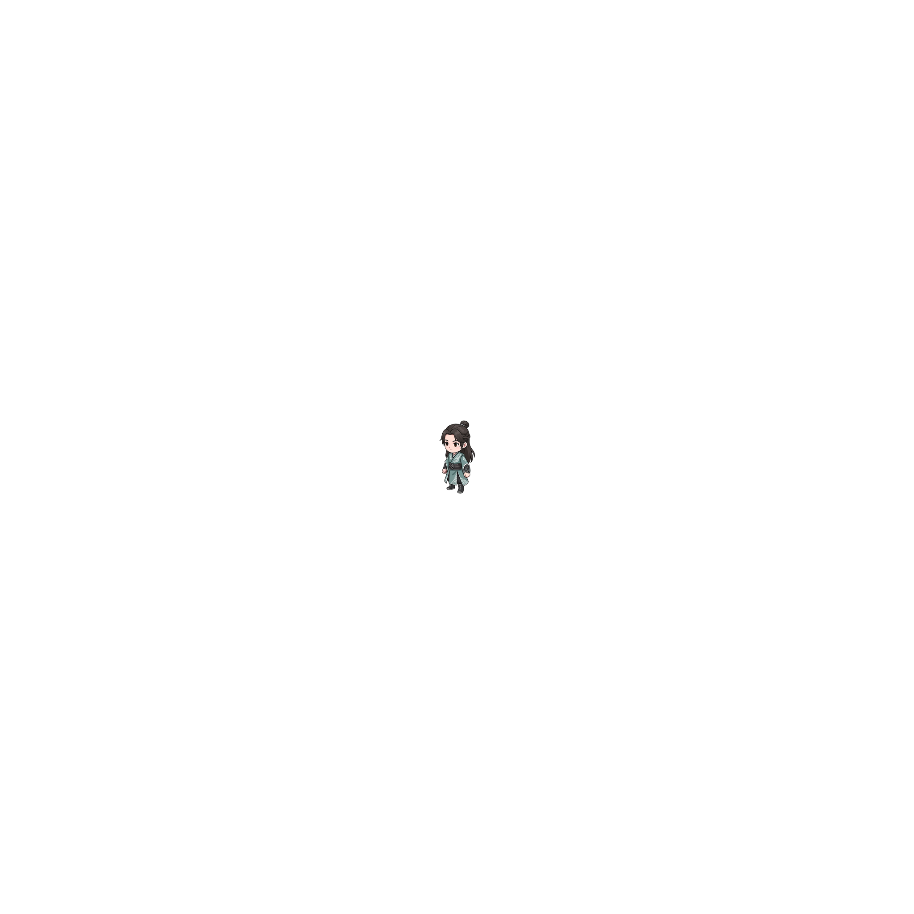

提示词：

> 为图中小人生成一个地图。俯视图，上帝视角。图中小人在地图上走动。一张纯粹的草地地形贴图。中国风修仙游戏底层地图风格，传统水墨与水彩结合的手绘质感，画面只有平铺的翠绿草皮、细小的草丛和零星青苔，还站着一个图中的游戏角色。不要任何树木、建筑、水域或石头，画面干净

就能够得到：

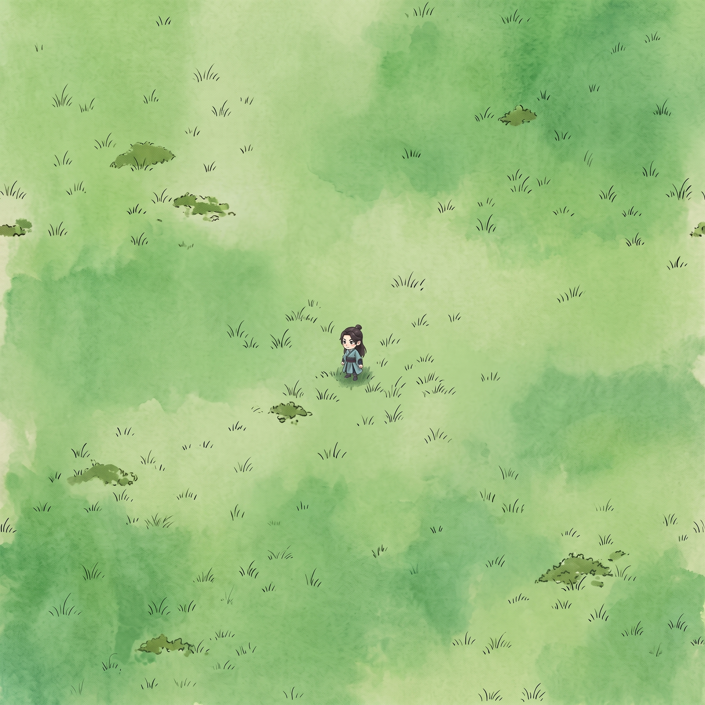

然后通过扩图的方式，将地图无限扩大

| 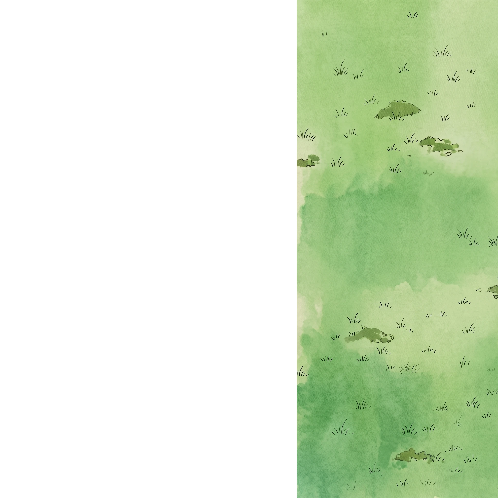 | 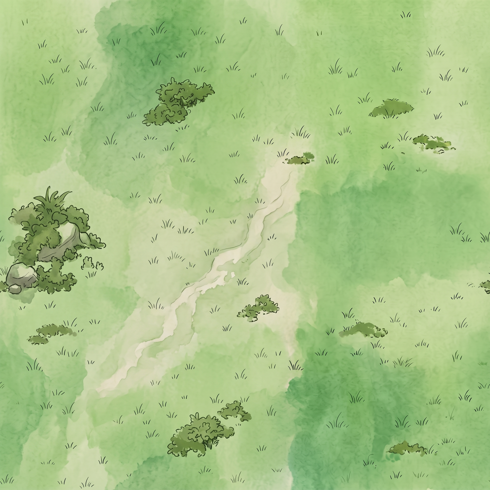 |
| --- | --- |

> 帮我把图中白色区域，填充和图中内容一致的场景，实现无缝扩图，注意这是一个上帝视角的中国修仙手绘风格的游戏地形素材图。保持色彩信息一致

### 地图素材批量命名工具：

链接: [https://pan.baidu.com/s/13U-FEdS3_9mAMqZ6jGZECg](https://pan.baidu.com/s/13U-FEdS3_9mAMqZ6jGZECg) 提取码: xysz

### 将地图引入到游戏中提示词：

> 我在根目录放了一堆的地图素材，请你移动到对应的目录，这是25块图片组成的大地图，我想将这个地图命名叫：青云山；后续我还会给你很多别的大地图素材；注意是可扩展的地图哦。

## 游戏封面视频提示词

> 一幅超宽幅全景的东方仙侠山水插画，云海之上漂浮着多座岩石仙岛，中央是一组宏伟的古代中式宫殿与山门，重檐歇山顶、木质梁柱、灰青瓦片，背后耸立陡峭高大的青灰色仙山峭壁；左右两侧有悬浮小岛、古亭、宝塔、松树与石桥相连，远处还有漂浮山峰与瀑布倾泻入云海。画面充满金色灵光粒子、发光符文、蜿蜒流动的白色云带与仙气，几只发光白鹤在空中飞翔。构图为史诗级横向展开，中央宫殿作为视觉焦点，前景有层层卷云和岩石形成纵深，中景建筑群细节丰富，远景山峦朦胧。柔和神圣的晨曦穿透云层形成体积光，金色与青蓝色交织，水墨线稿结合细腻水彩上色，宣纸纹理，手绘东方幻想风格，梦幻、宁静、庄严、仙境氛围，高细节，高质量，电影级光影，2D概念艺术。

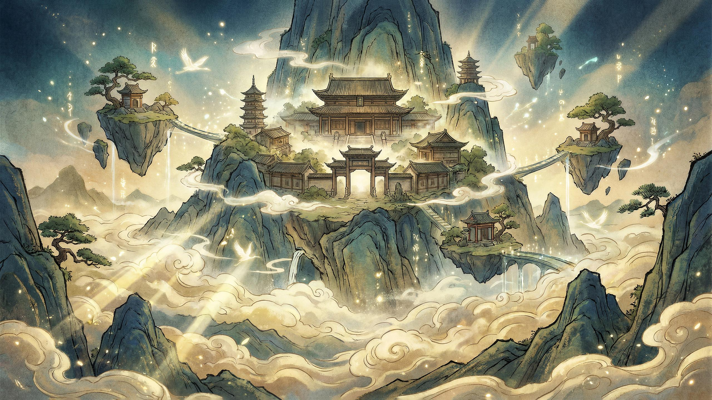

> 我需要根据这个图片，生成一个无缝循环的视频，你可以根据这个图片，再参考下方的提示词，帮我生成一个AI视频提示词。
> 实例提示词：
>
> 中国水墨画风格动画，固定镜头 一座雄伟的仙宫漂浮在云海之上的空中山巅。 轻柔的云朵缓缓飘荡，形成一个个循环往复的画面。 优雅的仙鹤翩翩起舞，划出一道道优美的弧线，构成一个完美的圆环。 一道小瀑布从浮岛上缓缓流淌而下。 闪耀的金光在空中轻柔地漂浮闪烁，形成一个个循环图案。 宁静、神秘、空灵的氛围。 传统中国奇幻风格，水墨质感，笔触柔和。 镜头锁定，固定镜头，无移动。 缓慢流畅的动画。 无缝循环动画。 完美循环视频。 可循环播放。 首帧与末帧完全一致。 循环点无明显的跳帧或切入。

## NPC设计

> [一位年轻俊美的古风男子半身立绘，仙侠书生气质，正面略微转向左侧，目光平静温和，五官清秀，剑眉长眼，长棕色头发高束马尾，发丝自然垂落在肩前，佩戴细发带。身穿浅青绿色宽袖汉服外袍，内搭白色交领中衣与灰色衣襟，腰间深灰色腰带，衣料轻薄柔软，层次分明。双手持一卷古代卷轴，卷轴为浅米白色纸面，两端木轴装饰，手指修长细致] 白色纯背景，无复杂场景，居中构图，半身像到腰部，平视镜头，柔和自然光，低对比阴影，淡雅水彩与细腻线稿结合的古风插画风格，色彩清新克制，笔触轻柔，人物轮廓干净，细节精致，高质量数字绘画。
