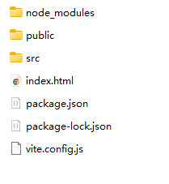
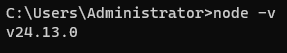
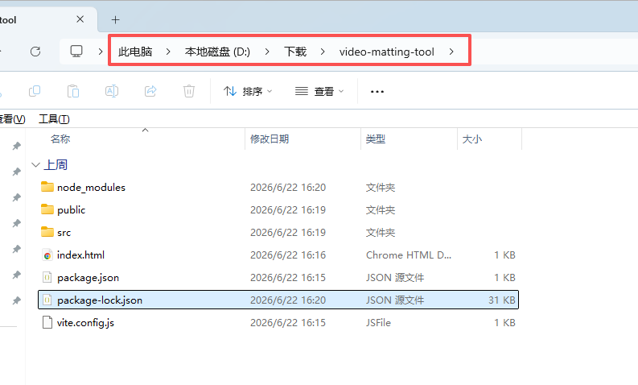
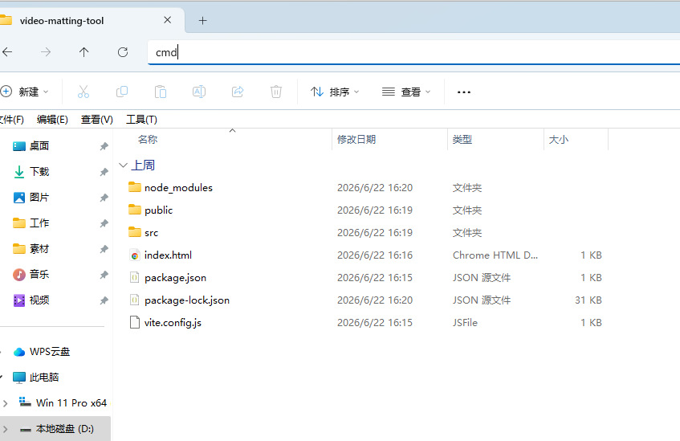
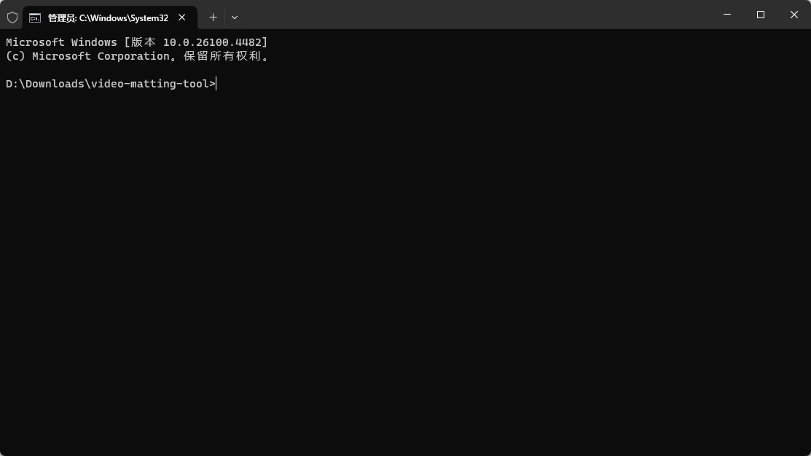
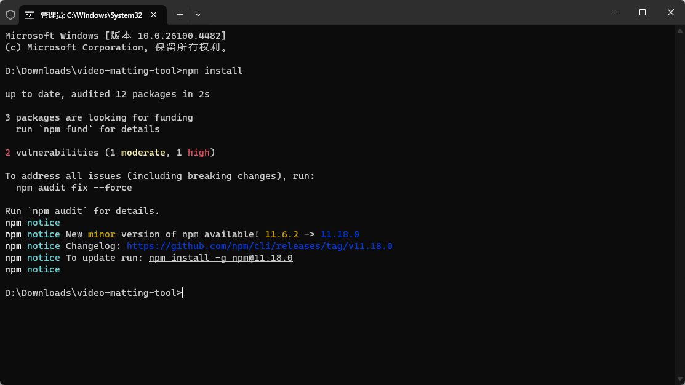
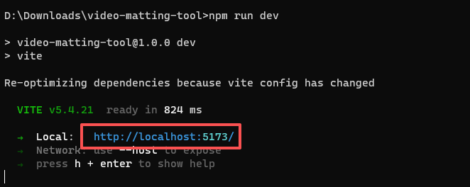
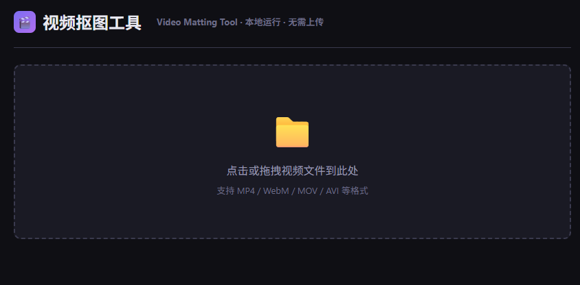

# 视频抠图工具教程

下载后，会得到这样的一个文件夹

这个需要用node.js来运行，需要先安装一下node.js

## 如何判断自己电脑有没有安装node.js?

**按下键盘上的****Win + R****键，输入****cmd****并回车，打开黑色命令行窗口。输入****node -v****并回车，如果出现类似****v24.13.0****的版本号，说明已经安装过了**

## 安装Node.js

打开浏览器，访问 Node.js 官网：

https://nodejs.org/

点击页面上绿色的

“LTS”（长期支持版）

按钮进行下载。

双击下载好的安装包，

一直点击“下一步”

，直到安装完成（全程不需要修改任何设置）。

**按下键盘上的****Win + R****键，输入****cmd****并回车，打开黑色命令行窗口。输入****node -v****并回车，如果出现类似****v24.13.0****的版本号，说明安装成功**

## 使用教程

进入这个工具的文件夹，然后点击地址栏，输入cmd 直接敲回车

然后依次执行下面的命令，粘贴进去，敲回车

> npm install

> npm run dev

会自动打开网页，如果没有打开网页，就复制上面红框的链接到浏览器打开即可

